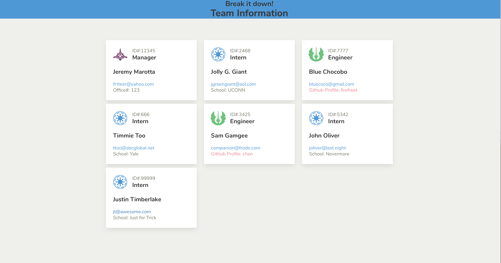

# Template Engine

Command line application for creating a web page on the fly that displays basic information about a software development team. Includes high level information about each member such as Name, Email Address, Employee ID, Role, and Role specific info.

When run, the user is asked to input a the above details about each person on the team.

...as per common user story format...

```
As a manager
I want to generate a webpage that displays my team's basic info
so that I have quick access to emails and GitHub profiles
```

# Key node dependencies
Requires the following modules be installed
*   jsdom - creates a facsimile of a browser DOM to allow maniputaltion of HTML strings as if they were in a browser
*   jquery - for easy selectors of the mock DOM
*   util - allows the transformation of standand functions with callback parameters into promises
*   fs - for reading and writing files
*   open - which helps to open a file in the default application as defined by the OS
*   inquirer - to get information from the user at the command line

 ### Also used in production

*   jest - for test cases
*   bulma - CSS framework using sass
*   node-sass - used to compile sass

## Example of application output


